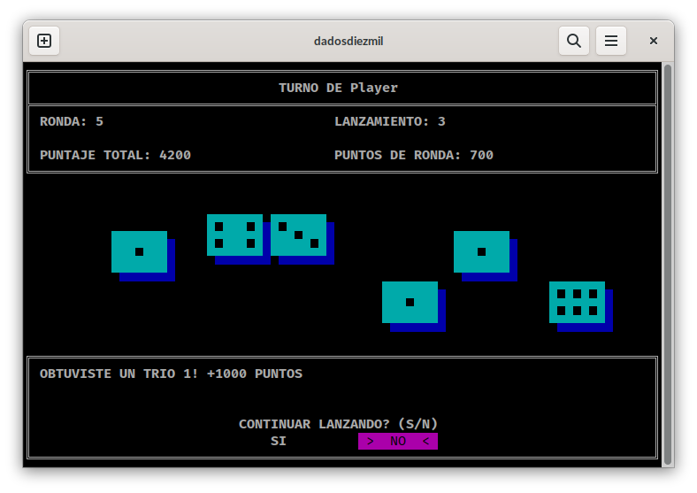

# Trabajo Práctico - Juego de dados diez mil.

Hecho con C++, usando rlutil.



## Reglas del juego: 
Objetivo: obtener 10000 puntos en la menor cantidad de rondas posibles. Cada ronda está compuesta por varios lanzamientos.

## Combinaciones ganadoras:
| Combinaciones | Puntos |
|-------------------------|-----------------------------------------|
| 1 ó 2 dados con valor 1 | 100 puntos por cada dado con el valor 1 |
| 1 ó 2 dados con valor 5 | 50 puntos por cada dado con valor 5 |
| 3 dados con valor 1 | 1000 puntos |
| 3 dados o más con el mismo valor (X es el número del dado) | X*100 puntos |
| 4 ó 5 dados con el valor 1 | 2000 puntos |
| Escalera de 6 dados | 1500 puntos |
| Seis unos | Gana la partida en esa ronda. |


## Compilado:
```
g++ main.cpp -o dados10k.exe
```